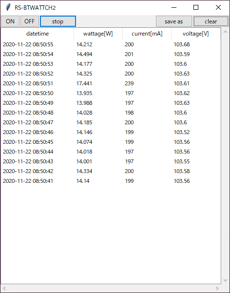
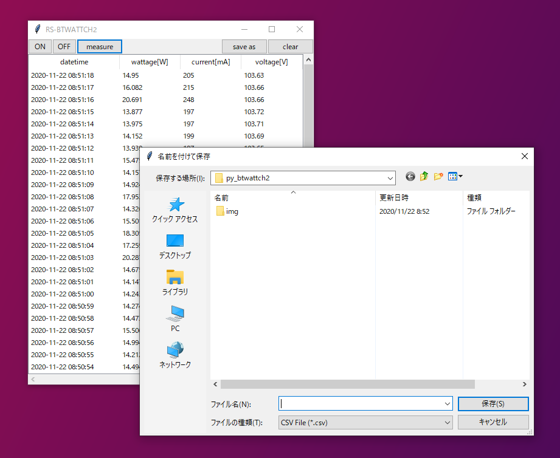

# py_btwattch2
Python GUI client for RS-BTWATTCH2 bluetooth power meter

RS-BTWATTCH2の毎秒測定値(消費電力[W], 電流[mA], 電圧[V])をTkinterのウインドウに表示し、測定値のソートやCSVファイルへの保存が行えます。

実行にはPython 3.7以上が必要です。



# 使い方
依存パッケージのBleakをインストールします。
```
pip install bleak
```

pythonのインストールディレクトリが環境変数に登録されている場合は、以下のコマンドで実行できます。

```
python py_btwattch2.py
```

実行すると、接続されているRS-BTWATTCH2の選択ダイアログが表示されます。


`connect` をクリックするとRS-BTWATTCH2に接続を実行し、メインウインドウが表示されます。`measure` / `stop` で測定の開始/一時停止、`save as` からCSV形式で測定値の保存ができます。



# 免責
このスクリプトを使用したことによるいかなる損害についても作成者は責任を負いません。自己責任で使用してください。